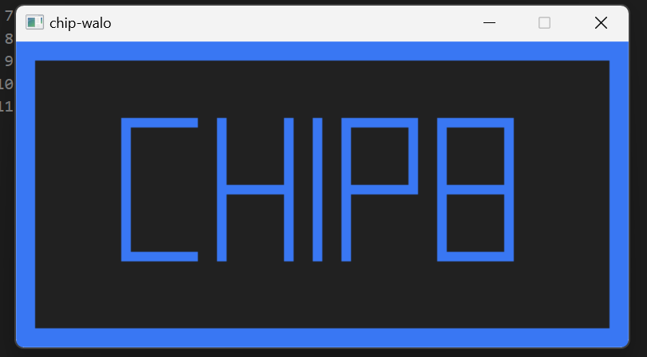
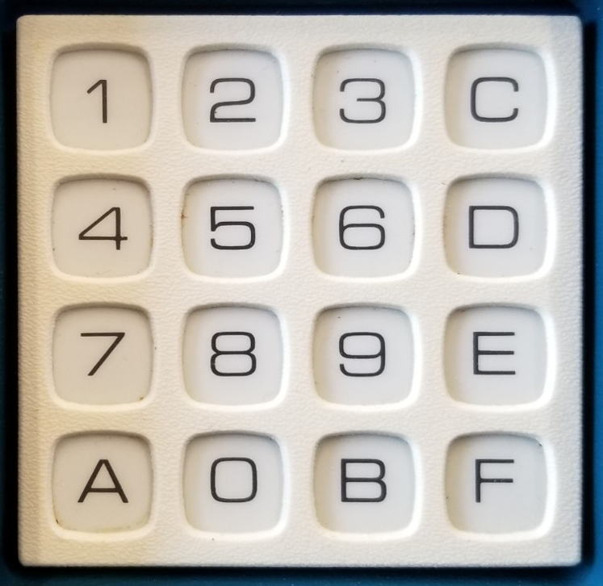
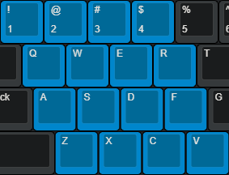

# chip-walo

CHIP-8 Emulator using C and SDL2.


## Table of Contents

- [chip-walo](#chip-walo)
  - [Table of Contents](#table-of-contents)
  - [Introduction](#introduction)
  - [Features](#features)
- [Samples](#samples)
- [Building](#building)
  - [Linux](#linux)
  - [Windows](#windows)
- [Usage](#usage)
  - [Run](#run)
  - [Input](#input)
- [Credits](#credits)
  - [Issue](#issue)
  - [Contribution](#contribution)

## Introduction

CHIP-8 is an interpreted programming language which was initially used in the late 1970s.

It was made to allow more easily programed game for those computers. All programs written in CHIP-8 are run on a virtual machine which interprets each instruction.

Reference: [Wikipedia](https://en.wikipedia.org/wiki/CHIP-8)

> The word *walo* is tagalog of number 8

## Features

- Working sound
- Cross-platform

# Samples



# Building

## Linux

Required:
- gcc
- unzip/7zip
- [xmake](https://xmake.io/#/guide/installation)

Download the repo:

```bash
git clone https://github.com/diamant3/chip-walo.git
```

build chip-walo:

```bash
cd chip-walo && xmake
```

## Windows

Required:

- [xmake](https://xmake.io/#/guide/installation)
- visual studio(MSVC)

SDL2 Installation using xmake package manager(xrepo):

```cmd
xrepo install libsdl
```

Download the repo:

```cmd
git clone https://github.com/diamant3/chip-walo.git
```

build chip-walo:

```cmd
cd chip-walo && xmake
```

# Usage

## Run

```
xmake run chip-walo PATH/OF/THE/ROM
```

## Input

**CHIP-8 Keypad**



> Image source: [Tobiasvl](https://tobiasvl.github.io/blog/write-a-chip-8-emulator/)

**PC Keyboard**



> This is the key mappings of the chip-walo.

# Credits

- [SDL2](https://www.libsdl.org/)
- [xmake](https://xmake.io/#/)
- [Cowgod](http://devernay.free.fr/hacks/chip8/C8TECH10.HTM)
- [Wikipedia](https://en.wikipedia.org/wiki/CHIP-8)
- [Multigesture](https://multigesture.net/articles/how-to-write-an-emulator-chip-8-interpreter/)
- [Tobiasvl](https://tobiasvl.github.io/blog/write-a-chip-8-emulator/)
- [Chip-8](https://chip-8.github.io/links/)
- [Zophar.net](https://www.zophar.net/pdroms/chip8.html)
- [chip8-test-suite by Timendus](https://github.com/Timendus/chip8-test-suite)

## Contribution

This is an educational project and feel free to contribute!
