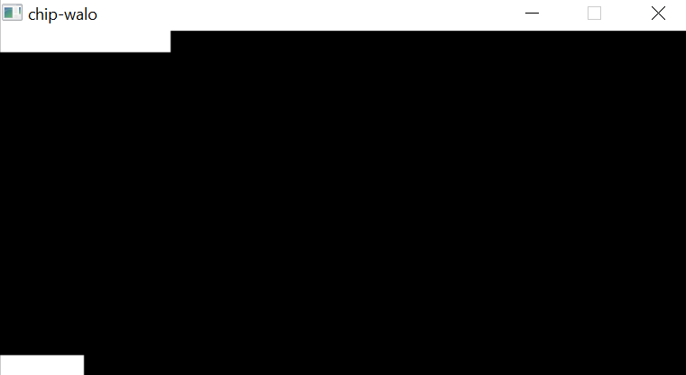

# CHIP-WALO


# Intro

*CHIP-8 is an interpreted programming language which was initially used in the late 1970s. It was made to allow more easily programed game for those computers. All programs written in CHIP-8 are run on a virtual machine which interprets each instruction.*

Reference: [Wikipedia](https://en.wikipedia.org/wiki/CHIP-8)

>"WALO" is from the tagalog word of the number 8.

# Game samples

## Space Invaders


## Breakout


# Usage

<table>
  <tr>
      <td>1</td>
      <td>2</td>
      <td>3</td>
      <td>4</td>
  </tr>
  <tr>
      <td>Q</td>
      <td>W</td>
      <td>E</td>
      <td>R</td>
  </tr>
  <tr>
      <td>A</td>
      <td>S</td>
      <td>D</td>
      <td>F</td>
  </tr>
  <tr>
      <td>Z</td>
      <td>X</td>
      <td>C</td>
      <td>V</td>
  </tr>
</table>

> This is the key mappings of the chip-walo, use keyboard to control.

# Build/Run:

To download this repo, run this:

```bash 
git clone https://github.com/diamant3/chip-walo.git
``` 
After you download:

```bash
cd chip-walo 
```

## Build

Build the executable file:

```bash
make
```

>Note: The executable file is located in ``` bin ``` folder.

## Run

Two ways to run this:

### Windows

```bash
chip-walo PATH/OF/THE/ROM
```

>Download first the 32-bit runtime binary from [SDL2](https://www.libsdl.org/) and put it in the ``` bin ``` folder.

### Linux

```bash
Untested
```

# :heart: Credits

[SDL](https://www.libsdl.org/) - graphics API that i used to make this.<br>
[Cowgod](http://devernay.free.fr/hacks/chip8/C8TECH10.HTM) - Heavily used for the references of the op codes.<br>
[Wikipedia](https://en.wikipedia.org/wiki/CHIP-8) - Another reference for op codes.<br>
[Multigesture](https://multigesture.net/articles/how-to-write-an-emulator-chip-8-interpreter/) - 1/4 of my code is mostly from here.<br>
[Tobiasvl](https://tobiasvl.github.io/blog/write-a-chip-8-emulator/)- Clear explanation about chip-8.<br>
[Chip-8](https://chip-8.github.io/links/) - Chip-8 Resources.<br>
[Zophar.net](https://www.zophar.net/pdroms/chip8.html) - chip-8 ROMS.<br>
