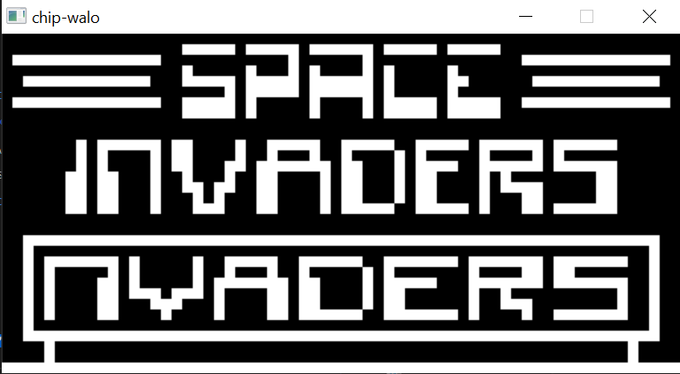

# CHIP-WALO


# Introduction:
CHIP-8 is an interpreted programming language which was initially used in the late 1970s. It was made to allow more easily programed game for those computers. All programs written in CHIP-8 are run on a virtual machine which interprets each instruction.

Reference: [Wikipedia](https://en.wikipedia.org/wiki/CHIP-8)<br>
*Witty Note: "walo" is from the tagalog word of the number 8.*

# Game samples

## Space Invaders


## Breakout


# Usage:

To download this repo, run this:
```bash 
git clone https://github.com/diamant3/chip-walo.git
``` 
After you download, run this:
```bash
cd chip-walo 
```
## Build:
If you want to build the object files only, run this:
```bash
make
``` 
If you want the build the executable, run this:
```bash
make && make all
```

*Note: The executable file is located in ``` bin ``` folder.*

## Run:
Two ways to run this:
### Windows
```bash
chip-walo PATH/OF/THE/ROM
```
*Note: The sdl2 is pre-installed, just build and run. the ```SDL2.dll``` file in ```bin``` directory is required. do not delete.*
### Linux
```bash
Untested - Under testing
```
# :heart: Credits:

[SDL](https://www.libsdl.org/) - My graphics API<br>
[Cow God](http://devernay.free.fr/hacks/chip8/C8TECH10.HTM8) - Heavily used for the references of the op codes<br>
[Wikipedia](https://en.wikipedia.org/wiki/CHIP-8) - Another reference for op codes<br>
[Multigesture](https://multigesture.net/articles/how-to-write-an-emulator-chip-8-interpreter/) - 1/4 of my code is mostly from here.<br>
[Tobiasvl](https://tobiasvl.github.io/blog/write-a-chip-8-emulator/)- Good explanation about chip-8<br>
[Chip-8 ](tps://chip-8.github.io/links/) - Chip-8 Resources<br>
[Zophar.net](https://www.zophar.net/pdroms/chip8.html) - chip-8 ROMS<br>
